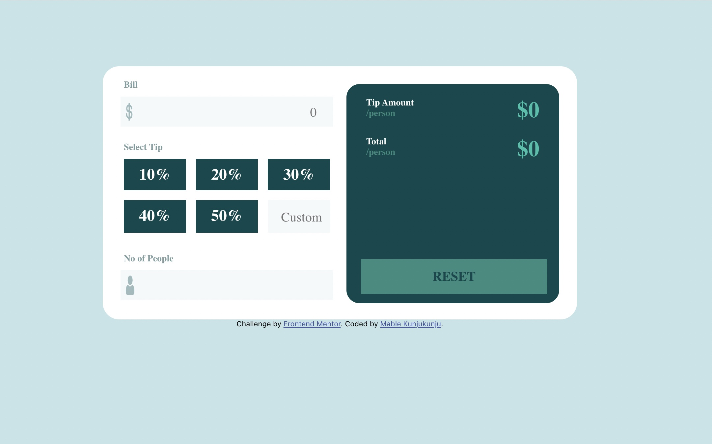

# Frontend Mentor - Tip calculator app solution

This is a solution to the [Tip calculator app challenge on Frontend Mentor](https://www.frontendmentor.io/challenges/tip-calculator-app-ugJNGbJUX). Frontend Mentor challenges help you improve your coding skills by building realistic projects.

## Table of contents

- [Overview](#overview)
  - [The challenge](#the-challenge)
  - [Screenshot](#screenshot)
  - [Links](#links)
- [My process](#my-process)
  - [Built with](#built-with)
  - [What I learned](#what-i-learned)
  - [Continued development](#continued-development)
  - [Useful resources](#useful-resources)
- [Author](#author)


## Overview

### The challenge

Users should be able to:

- View the optimal layout for the app depending on their device's screen size
- See hover states for all interactive elements on the page
- Calculate the correct tip and total cost of the bill per person

### Screenshot




### Links

- Solution URL: [Add solution URL here](https://your-solution-url.com)
- Live Site URL: [Add live site URL here](https://your-live-site-url.com)

## My process

### Built with

- Semantic HTML5 markup
- CSS custom properties
- Flexbox
- Grid
- Mobile-first workflow
- [React](https://reactjs.org/) - JS library
- [Redux](https://redux.js.org/) - State Container for JS Apps


### What I learned

Use this section to recap over some of your major learnings while working through this project. Writing these out and providing code samples of areas you want to highlight is a great way to reinforce your own knowledge.

To see how you can add code snippets, see below:

```html
<div id='container-input'>        
      <div>
          <label className='container-input-label'>Bill</label><br></br>
            <!-- <UserInputBox img={dollar} cuurValue={billContext.billAmount} onText={(event)=>setBillAmount(event)} ></UserInputBox> -->
        </div>
        <div>
        
        <label className='container-input-label' id='label-section'>Select Tip</label>
        <!-- <SelectTipComponent></SelectTipComponent> -->
        </div>  
        
        <div>
        <div className='person-label-div'>
        <!-- <label className='container-input-label'>No of People</label> {isPersonZero&& <label id='person-label-div'>&nbsp;&nbsp;couldn't be zero</label>} <br></br> -->
        </div >
        <!-- <PersonInputBox personZero={isPersonZero} img={person} cuurValue={billContext.noOfPeople} onText={(event)=>setNumOfPerson(event)}></PersonInputBox> -->
        </div>
       
        </div>      
```
```css
@media (max-width: 800px) {

    #container-input{
        display: grid;
        grid-template-columns: 1fr;
        grid-template-rows: 1fr 1fr 1fr;
        background-color: hsl(0, 0%, 100%);
        padding: 10px 10px 20px 10px;
        box-sizing: border-box;
        top: 0;
        height: 90%;
        margin-bottom: 20px;
        
    }
}
```
```js
const setNumOfPerson = (event) =>{
        if(event.target.value.length<=10){

        billContext.setNumOfPeople(event.target.value);
        }

        let zeroCheck = event.target.value==0 ? true : false
        setIsPersonZero(zeroCheck)
        billContext.setIsNumOfPeople(true)

        //set-no-people
        dispatch({type:'set-no-people',status:true});

    }

```

### Continued development

Use this section to outline areas that you want to continue focusing on in future projects. These could be concepts you're still not completely comfortable with or techniques you found useful that you want to refine and perfect.

**Note: Delete this note and the content within this section and replace with your own plans for continued development.**

### Useful resources

- [React Development](https://react.dev/) - This helped me to build user interface out of individual peices called components. I really liked this pattern and will use it going forward.
- [CSS Tricks](https://css-tricks.com/) - This is an amazing platform me learn and apply CSS grids, flexbox in components. I'd recommend it to anyone still learning this concept.


